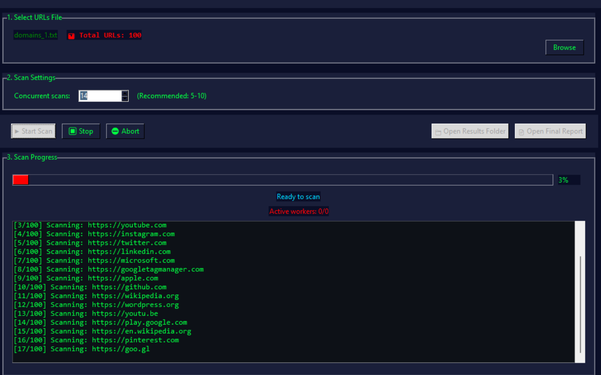

# crossX



crossX is a small GUI/CLI helper for scanning multiple domains at once for XSS-related vectors. The repository contains a Scrapy-based spider and helper scripts to run quick checks against a set of targets.

Features
- Scan multiple domains/URLs concurrently
- Scrapy-based spider located in `xsscrapy/` with `xss_spider.py`
- Small helpers and sample test pages in `tests/`


Quickstart
1. Create a Python virtual environment and install dependencies:

```bash
python3 -m venv .venv
source .venv/bin/activate
pip install -r requirements.txt
```

2. Run the main tool (example):

```bash
python3 crossx.py
# or run the Scrapy spider directly
python3 xsscrapy.py
```

Repository layout (important files)
- `crossx.py` — main entry script
- `xsscrapy/` — Scrapy project, spiders and helpers
- `tests/` — sample pages used for local testing

Notes about `.gitignore`
- A `.gitignore` was added to ignore common artifacts including `result/` and caches.
- The repository currently includes `__init__.py` in `.gitignore` (per prior request). This is unusual for source files; consider removing that entry if you want package files tracked.

Contributing
- Feel free to open issues or PRs. If you want, I can also add a small example target list and a run script.

xsscrapy
-----

Fast, thorough, XSS/SQLi spider. Give it a URL and it'll test every link it finds for cross-site scripting and some SQL injection vulnerabilities. See FAQ for more details about SQLi detection.

From within the main folder run:

```bash
./xsscrapy.py -u http://example.com
```
If you wish to login then crawl:

```bash
./xsscrapy.py -u http://example.com/login_page -l loginname
```
If you wish to login with HTTP Basic Auth then crawl:

```bash
./xsscrapy.py -u http://example.com/login_page -l loginname --basic
```
If you wish to use cookies:

```bash
./xsscrapy.py -u http://example.com/login_page --cookie "SessionID=abcdef1234567890"
```
If you wish to limit simultaneous connections to 20:

```bash
./xsscrapy.py -u http://example.com -c 20
```
If you want to rate limit to 60 requests per minute:

```bash
./xsscrapy.py -u http://example.com/ -r 60
```
XSS vulnerabilities are reported in `xsscrapy-vulns.txt`

Dependencies
----------
```
wget -O https://bootstrap.pypa.io/get-pip.py
python get-pip.py
pip install -r requirements.txt
```
May need additional libraries depending on OS: libxml2, libxslt, zlib, libffi, openssl (sometimes `libssl-dev`).

Tests
-----
- Cookies
- User-Agent
- Referer
- URL variables
- End of URL
- URL path
- Forms both hidden and explicit

FAQ
---
If it gives an error : `ImportError: cannot import name LinkExtractor`. This means that you don't have the latest version of scrapy. You can install it using:

```bash
sudo pip install --upgrade scrapy
```

It's called XSScrapy, so why SQL injection detection too? There is overlap between dangerous XSS chars and dangerous SQL injection characters, namely single and double quotes. Detecting SQL injection errors in a response is also simple and non-CPU-intensive. So although 99% of this script is strongly geared toward high and accurate detection of XSS, adding simple SQL injection detection through error message discovery is a simple and effective addition. This script will not test for blind SQL injection. Error messages it looks for come straight from w3af's sqli audit plugin.

License
-------
Copyright (c) 2014, Dan McInerney All rights reserved.

Redistribution and use in source and binary forms, with or without modification, are permitted provided that the following conditions are met:

- Redistributions of source code must retain the above copyright notice, this list of conditions and the following disclaimer.
- Redistributions in binary form must reproduce the above copyright notice, this list of conditions and the following disclaimer in the documentation and/or other materials provided with the distribution.
- Neither the name of Dan McInerney nor the names of its contributors may be used to endorse or promote products derived from this software without specific prior written permission.
- THIS SOFTWARE IS PROVIDED BY THE COPYRIGHT HOLDERS AND CONTRIBUTORS "AS IS" AND ANY EXPRESS OR IMPLIED WARRANTIES, INCLUDING, BUT NOT LIMITED TO, THE IMPLIED WARRANTIES OF MERCHANTABILITY AND FITNESS FOR A PARTICULAR PURPOSE ARE DISCLAIMED. IN NO EVENT SHALL THE COPYRIGHT HOLDERS OR CONTRIBUTORS BE LIABLE FOR ANY DIRECT, INDIRECT, INCIDENTAL, SPECIAL, EXEMPLARY, OR CONSEQUENTIAL DAMAGES (INCLUDING, BUT NOT LIMITED TO, PROCUREMENT OF SUBSTITUTE GOODS OR SERVICES; LOSS OF USE, DATA, OR PROFITS, OR BUSINESS INTERRUPTION) HOWEVER CAUSED AND ON ANY THEORY OF LIABILITY, WHETHER IN CONTRACT, STRICT LIABILITY, OR TORT (INCLUDING NEGLIGENCE OR OTHERWISE) ARISING IN ANY WAY OUT OF THE USE OF THIS SOFTWARE, EVEN IF ADVISED OF THE POSSIBILITY OF SUCH DAMAGE.

Multiple-domain GUI usage
-------------------------
This repository provides a simple GUI helper (and a CLI entry) for scanning multiple domains at once. To run the common Python entry script, from the project root run:

```bash
python3 crossx.py
# or
python crossx.py
```

The GUI will allow you to supply multiple targets and will invoke the underlying `xsscrapy` logic (or the Scrapy spider) for each domain. If you'd like, I can add a short example target list and a small wrapper script that runs `xsscrapy.py` for each domain in a file.
